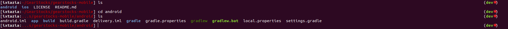
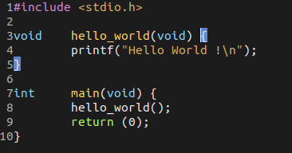

# Emacs-and-OMZ-Configuration






# Installing a Theme
Add `ixtazia.zsh-theme` in `.oh-my-zsh/themes/ixtazia.zsh-theme`


# Selecting a Theme

Change the ZSH_THEME in `.zshrc`

```shell
ZSH_THEME="ixtazia"
```

# Change emacs Theme

Replace .emacs

#DONE 🎉 !!